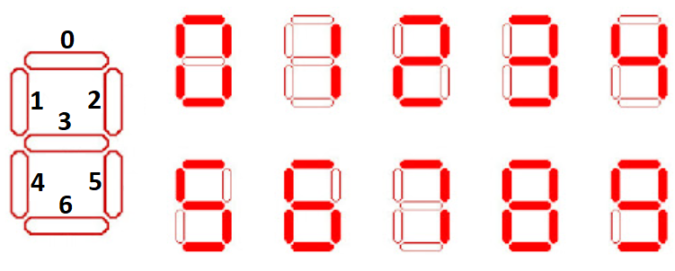

# PJP PAC 2

En aquesta PAC practicarem la programació amb JavaScript per mitjà d'exercicis concrets que avaluaran una o diverses característiques del llenguatge.

## Competències

En aquesta PAC es desenvolupen les següents competències del Màster:

* [CB10] Que els estudiants tinguin les habilitats d'aprenentatge que els permetin continuar estudiant d'una manera que haurà de ser en gran mesura autodirigida o autònoma.
* [CG1] Analitzar i sintetitzar informació tècnica complexa.
* [CE3] Utilitzar de manera adequada els llenguatges de programació i les millors eines de desenvolupament per a l'anàlisi, el disseny i la implementació de llocs i aplicacions web en funció de les necessitats del projecte.
* [CE8] Adaptar-se a les tecnologies web i als futurs entorns actualitzant les competències professionals.

## Objectius

Els objectius concrets daquesta PAC són:

* Aprendre a utilitzar JavaScript i les seues característiques bàsiques.
* Contribuir a conèixer a fons el llenguatge JavaScript per poder fer-lo servir en el desenvolupament d'aplicacions Web.

## Lliurament de la PAC

Un cop hagis realitzat les activitats pràctiques proposades en aquest enunciat, **el lliurament es realitzarà de forma doble**:

- Haurà d'enviar els vostres canvis a l'apartat de l'aula virtual de la UOC.
- Hauràs d'enviar els teus canvis al repositori de GitHub Classroom.

Recorda que aquest repositori l'has clonat del repositori a GitHub. Quan treballis al teu sistema, tots els canvis els faràs als teus fitxers locals, els quals hauràs d'afegir i _comitejar_ al teu repositori Git. Aquests canvis estaran al teu sistema fins que facis _push_ i els enviïs al repositori a GitHub.

Recorda que has de treballar a la branca _main_ o _master_ (la que es creu per defecte). Pots fer diversos enviaments.

A l'aula virtual trobaràs una _checklist_ que t'ajudarà a repassar tots els passos que has de fer per al lliurament de la teva PAC.

## Puntuació

El fet de treballar amb tests per verificar la funcionalitat del codi us permetrà tenir una idea de la vostra pròpia nota abans del lliurament.

La puntuació dels exercicis pràctics es basa en dos criteris: **Funcionalitat** i **Implementació**. S'espera que els exercicis funcionin correctament (passin els tests) i que la implementació (el codi) tingui una qualitat adequada.

Alguns detalls a tenir en compte:

- Es penalitzarà qualsevol intent de _hardcodejar_ els tests per forçar que passin. Aquesta tècnica consisteix a canviar la implementació perquè torni únicament el valor esperat pel test (qualsevol altre test fallaria).
- Els tests automàtics estan dissenyats per detectar exercicis erronis o incomplets per a casos concrets. El fet que un test passi no garanteix que lexercici estigui realitzat correctament, és a dir, que cobreixi tots els casos.
- Un exercici els tests del qual no passen es puntuarà amb un 0 llevat que hi hagi problemes amb el test.
- A més de passar els tests, el professorat avaluarà el vostre codi en base als següents criteris:
 - Llegibilitat, senzillesa i qualitat del codi.
 - Coneixements de programació. Per exemple, no utilitzar les estructures de control adequades, com ara utilitzar un bucle per construir una sentència condicional o viceversa.

## Requisits mínims

- Tenir instal·lat Visual Studio Code (o qualsevol altre IDE).
- Coneixements bàsics de Git i GitHub (Activitats 2 i 3 del Repte 1).
- Estudi de la introducció i repàs a JavaScript (Activitat 1 del Repte 2).
- Estudi de conceptes de JavaScript (Activitat 2 del Repte 2).

## Exercicis pràctics (10 punts)

Per realitzar els exercicis pràctics t'has de dirigir a la següent ruta, dins del repositori: `src/pec2/pec2.js`.
En aquest fitxer hauràs d'implementar les funcions que t'indiquem als exercicis que veuràs més avall.

D'altra banda, els tests que et permetran saber si la solució que proposes per als exercicis és correcta són al fitxer `src/pec2/pec2.spec.js`.
**No has d'editar aquest fitxer**.
Tingues en compte que els tests són condicions que han de complir les funcions que implementaràs en els exercicis, per la qual cosa et poden servir d'ajuda per corregir-los.

### Preparant l'entorn

Un cop fet **clone** del repositori, has d'instal·lar les dependències del projecte.

```
npm install
```

A continuació, per llançar els tests has d'executar la següent ordre:

```
npm t
```

La instrucció anterior llançarà els tests cada cop que desis el fitxer `src/pec2/pec2.js`, que és precisament on implementaràs els exercicis d'aquesta PAC.

Tal com t'indiquem a la PAC 1, la primera vegada que executis `npm t` i es llencin els tests, molt possiblement fallaran tots, ja que no hi ha cap exercici implementat. Conformi vagis treballant en els exercicis i guardis el fitxer, pot ser que algun test llanci algun error. Revisa el missatge d'error que s'imprimeix per conèixer el format i entendre com es notifiquen els errors.

Si tens algun problema amb els tests, no dubtis a preguntar al fòrum "Dubtes PAC 2 | Dubtes PAC 2" de l'aula.

### Exercici 1 (1.0 punt)

#### Objectiu

Implementar la funció que calculi el canvi per a una quantitat d'Euro donada, utilitzant el **menor nombre de bitllets i monedes possibles**. La funció ha de retornar el resultat en un format estructurat.

#### Descripció

Desenvolupa la funció `calculateChange(amount)` que rep un import en format de nombre decimal i retorna un objecte que representa el canvi amb el menor nombre possible de bitllets i monedes. La funció ha de contemplar els bitllets i monedes següents:

- Bitllets: 500€, 200€, 100€, 50€
- Monedes: 20€, 10€, 5€, 2€, 1€, 0.50€, 0.20€, 0.10€, 0.05€, 0.02€, 0.01€

#### Requisits

1. **Control d'Errors**: La funció ha de llançar un error amb el missatge `Amount must be a non-negative number` si l'import és un número negatiu.
2. **Format del Resultat**: El resultat ha de ser un objecte on les **keys** són els valors dels bitllets i monedes i els seus **values** són les quantitats necessàries de cada bitllet o moneda.

#### Exemple

```js
calculateChange(18.47);
// Output: {'10': 1, '5': 1, '2': 1, '1': 1, '0.2': 2, '0.05': 1, '0.02': 1 }
```

### Exercici 2 (1.5 punts)

#### Objectiu

Implementar una classe que simuli la representació d'un dígit en un rellotge digital fent servir un display de 7 segments. La representació del dígit s'ha de dibuixar en una matriu de 3 columnes per 5 files, utilitzant caràcters específics per simular els segments encesos.

#### Descripció

Un rellotge digital utilitza un display de 7 segments per mostrar cadascun dels dígits. Cada dígit (del 0 al 9) es compon de 7 segments que poden estar encesos o apagats. Aquests segments estan disposats amb la següent configuració:



Cada dígit es pot representar activant certs segments. Per exemple:
- El número `8` té tots els segments encesos.
- El número `1` només té els segments 2 i 5 encesos.

#### Instruccions

Crea una classe `DisplayDigit`, que contingui:

- Un constructor que inicialitzi una estructura de dígits codificats utilitzant un array bidimensional de números (amb valors 0 i 1) que representin els segments apagats o encesos. Cada número (0-9) ha de tenir una configuració específica d'aquesta estructura de dades que activi o desactivi els 7 segments.
- Un mètode `displayDigit(digit)` que accepti un únic paràmetre `digit` (un nombre sencer entre 0 i 9) i retorni un array de 5 cadenes de text, on cada cadena representa una fila de la matriu 3x5 corresponent al dígit mostrat en un rellotge digital.
 - Si el valor de `digit` no és un nombre vàlid entre 0 i 9, el mètode `displayDigit(digit)` ha de llançar un error amb el missatge següent: `The digit must be a number between 0 and 9`.
 - **Visualització dels segments**: En un entorn gràfic, on cada un dels 7 segments poden representar-se com a línies horitzontals o verticals, seria senzill representar visualment el display; n'hi hauria prou de mostrar o no cada segment en funció del valor del seu bit associat. En el nostre cas, també ens basarem en l'estructura de dígits codificats, però haurem d'implementar la visualització manualment, de manera que cada segment podrà ser representat per més d'un caràcter.

#### Configuració dels segments

Heu de crear una estructura que simuli els segments encesos o apagats utilitzant cadenes de caràcters per representar aquests segments.

Utilitza el caràcter "█" (bloc ple) per construir la representació d'un segment encès, i el caràcter " " (espai) per fer el mateix amb un segment apagat.

Per exemple, els segments horitzontals (0, 3 i 6) han d'estar composts de tres "█" o "" consecutius, en funció de si estan encesos o apagats, respectivament.

#### Exemples

Cridant a la funció amb el número 8, la sortida hauria de ser una matriu amb el contingut següent:

```js
[
  "███",  // Segment superior encès
  "█ █",  // Segments esquerre i dret (a dalt) encesos
  "███",  // Segment mitjà encès
  "█ █",  // Segments esquerre i dret (a baix) encesos
  "███"   // Segment inferior encès
]
```

Per al número 1, la sortida seria:

```js
[
  "  █",  // Segment superior apagat
  "  █",  // Només el segment dret (a dalt) encès
  "  █",  // Segment mitjà apagat
  "  █",  // Només el segment dret (a baix) encès
  "  █"   // Segment inferior apagat
]
```

>**Nota**: Fixa't que hi ha segments que comparteixen algun caràcter (es creuen). Per exemple, en el cas del número 1, els segments 0 i 2 comparteixen el caràcter superior dret. Hauràs de gestionar aquests encreuaments quan configuris la visualització dels segments.

### Exercici 3 (2.0 punts)

#### Objectiu

Implementar una classe que simuli un rellotge digital fent servir un display de 7 segments per representar l'hora actual (en format de 24 hores), minuts i segons.

#### Descripció

Un rellotge digital típic utilitza displays de 7 segments per representar els seus números. En aquest exercici, has de crear una classe que rebi la data i l'hora actual, i la mostri en un format visual similar al d'un rellotge digital de set segments:


#### Instruccions

- Implementar una classe `DigitalClock`, que contingui:
  - Un constructor que rebi un paràmetre que serà un objecte `Date`. Si el paràmetre no és una instància de `Date`, ha de llançar un error amb el missatge següent: `The parameter must be a Date object`.
    - Heu d'obtenir les hores (0-23), minuts (0-59), i segons (0-59) a partir del paràmetre de data rebut. 
    - Les propietats de la classe que emmagatzemaran aquests valors es diran: `hours`, `minutes` i `seconds`.
  - Mètode `displayTime()`:
    - Aquest mètode ha de formatar l'hora passada per paràmetre al constructor, en format HH:MM:SS, utilitzant un display de 7 segments per a cada dígit.
    - Ha de retornar un array de 5 cadenes de text, representant l'hora.
    - S'han de simbolitzar els dos punts `:` entre les hores, minuts i segons. Per això utilitzarem el caràcter de bloc ple "█".

**Nota**: Pots utilitzar mètodes complementaris, si ho necessites. Per exemple: Et podria ser molt útil un mètode `formatNumber(number)` per afegir un 0 a l'esquerra d'un dígit.

#### Exemple

```js
[
  '███   █     ███ ███     █ █ ███',
  '█ █   █  █    █   █  █  █ █ █  ',
  '█ █   █     ███ ███     ███ ███',
  '█ █   █  █  █     █  █    █   █',
  '███   █     ███ ███       █ ███'
]
```

### Exercici 4 (2.0 punts)

#### Objectiu

Implementar una estructura de classes i subclasses que modelin diferents tipus de construccions: Edificis, Ponts i Carreteres. Hauràs de crear una classe base `Construction` i després estendre altres classes més específiques: `Building`, `Bridge` i `Road`. Cada classe tindrà les pròpies propietats i mètodes que representen característiques i comportaments de cada tipus de construcció.

#### Instruccions

- Implementa una classe `Construction`, que compleixi amb les característiques següents:
  - Ha d'incorporar les següents **propietats**:
    - `name`: Nom de la construcció.
    - `location`: Ubicació de la construcció.
  - Has d'implementar els següents **mètodes**:
    - Getters i Setters per a totes les propietats. Han de ser mètodes bàsics, sense cap verificació.
    - `getDescription`: Heu de tornar un string amb el format següent: "[name] located in [location]".
    - `getTotalInstances`: Mètode *estàtic* que retorni el nombre total d'instàncies creades de la classe `Construction` i les seves subclasses. Per a això, pots utilitzar una propietat estàtica `instanceCount` que s'incrementi al constructor cada vegada que es creï una nova instància de la classe o les seves subclasses.

    >**Pista**: Obté Informació sobre mètodes i propietats estàtiques [aquí](https://developer.mozilla.org/en-US/docs/Web/JavaScript/Reference/Classes/static).

- Implementa una classe `Building`, que compleixi amb les característiques següents:
  - Ha d'estendre de la classe `Construction`.
   - Ha d'incorporar les següents **propietats**:
     - `floors`: Nombre de pisos de l'edifici
     - `material`: Material de construcció de l'edifici
   - Has d'implementar els següents **mètodes**:
     - Implementa els getters bàsics per a les noves propietats.
     - Implementa un setter per a la propietat `floors` que permeti assignar el nombre de pisos, amb els següents condicionants:
       - Només s'acceptaran valors numèrics entre 1 i 50.
       - Si el nombre de pisos és menor que 1 o més gran que 50, s'haurà de llançar un error amb el text següent: `The number of floors must be between 1 and 50`.
     - Implementa un setter per a la propietat `material` que permeti assignar el material, amb els següents condicionants:
       - El material ha de transformar-se a majúscules automàticament.
       - Si el material (ja en majúscules) no és `WOOD`, `STONE` o `GLASS`, has de llançar un error utilitzant amb el text: `Material must be one of the following: WOOD, STONE, GLASS`.
     - `getDescription`: Que retorni un string amb el format següent: "[name] located in [location] with [floors] floors built with [material]".

- Implementa una classe `Bridge`, que compleixi amb les següents característiques:
  - Ha d'estendre de la classe `Construction`.
  - Ha d'incorporar les següents **propietats**:
    - `length`: Longitud del pont, en metres.
    - `maxLoad`: Capacitat màxima de càrrega, en tones.
  - Has d'implementar els següents **mètodes**:
    - Getters i Setters per a les noves propietats. Han de ser mètodes bàsics, sense cap verificació.
    - `getDescription`: Que retorni un string amb el següent format: "[name] located in [location] spanning [length] meters, max load [maxLoad] tons".

- Implementa una classe `Road`, que compleixi amb les següents característiques:
  - Ha d'estendre de la classe `Construction`.
  - Ha d'incorporar les següents **propietats**:
    - `lanes`: Nombre de carrils.
    - `surfaceMaterial` Material de la superfície de la carretera.
  - Has d'implementar els següents **mètodes**:
    - Implementa un getter per a la propietat `lanes` que retorni el nombre de carrils.
    - Implementa un setter per a la propietat `lanes` que permeti assignar el nombre de carrils, amb els següents condicionants:
      - Si el valor de `lanes` no és un nombre positiu més gran que 0, llança un error amb el text: `Lanes must be a positive number greater than 0`.
      - Si el valor de `lanes` és més gran que 5, el setter ha d'ajustar automàticament el valor a 5.
    - Implementa un getter per a la propietat `surfaceMaterial` que retorni el material de la superfície.
    - Implementa un setter per a la propietat `surfaceMaterial` que permeti assignar el material de la superfície.
    - `getDescription`: Que retorni un string amb el format següent: "[name] located in [location] with [lanes] lanes, surfaced with [surfaceMaterial]".

### Exercici 5 (2.5 punts)

#### Objectiu

Implementar una estructura de classes que ampliï l'estructura de l'exercici anterior, introduint nous tipus de ponts: `SuspensionBridge` i `ArchBridge` i de carreteres: `Highway` i `Street`. Cada classe tindrà les pròpies propietats i mètodes que representin característiques específiques de cada tipus de construcció.

#### Instruccions

- Implementa una classe `SuspensionBridge`, que compleixi les següents característiques:
  - Ha d'estendre de la classe `Bridge`.
  - Ha d'incorporar la **propietat**:
    - `cableType`: Tipus de cable utilitzat al pont penjant.
  - Has d'implementar els següents **mètodes**:
    - Getters i Setters per a la propietat `cableType`. El setter ha de permetre assignar qualsevol valor com a tipus de cable.
    - `getDescription`: que retorni un string amb el format següent: "Suspension Bridge: [name] located in [location] spanning [length] meters, max load [maxLoad] tons, using [cableType] cables".

- Implementa una classe `ArchBridge`, que compleixi amb les característiques següents:
  - Ha d'estendre de la classe `Bridge`.
  - Ha d'incorporar la **propietat**:
    - `archMaterial`: Material amb què estan fets els arcs del pont.
  - Has d'implementar els següents **mètodes**:
    - Getters i Setters per a la propietat `archMaterial`. El setter ha de permetre assignar qualsevol valor com a material de l'arc.
    - `getDescription`: Que ha de tornar un string amb el format següent: "Arch Bridge: [name] located in [location] spanning [length] meters, max load [maxLoad] tons, with arches made of [archMaterial]" .

- Implementa una classe `Highway`, que compleixi amb les característiques següents:
  - Ha d'estendre de la classe `Road`.
  - Ha d'incorporar les següents **propietats**:
    - `tollRoad`: valor booleà que indica si l'autopista té peatge.
    - `suspensionBridges`: Un array que conté instàncies de `SuspensionBridge`.
    - `archBridges`: Un array que conté instàncies de `ArchBridge`.
  - Has d'implementar els següents **mètodes**:
    - Getters i Setters per a la propietat `tollRoad`. El setter només ha d'acceptar valors booleans; si el valor de `tollRoad` no és un valor booleà, has de llançar un error amb el text: `tollRoad must be a boolean value`.
    - `addSuspensionBridge` i `addArchBridge`: Per afegir ponts del tipus corresponent als vostres arrays. Si intenteu afegir una instància que no sigui del tipus adequat, s'ha de llançar un error amb el missatge: `Only SuspensionBridge instances can be added` o `Only ArchBridge instances can be added`, segons correspongui.
    - `removeSuspensionBridge` i `removeArchBridge`: Per eliminar ponts de l'array corresponent.
    - `getTotalBridges`: Que ha de tornar el nombre total de ponts (tant de penjants com d'arc).
    - `getDescription`: Heu de tornar un string que inclogui informació sobre els ponts i si l'autopista té peatge, amb el format següent: "Highway: [name] located in [location] with [lanes] lanes, surfaced with [surfaceMaterial] , [tollRoad ? 'toll road' : 'no toll'], with [totalBridges] bridges: [suspensionBridges descriptions] [archBridges descriptions]". Si no té ponts, ha de retornar "no bridges". Exemples:
      - **Sense ponts**: "Highway: Main Highway located in City A with 4 lanes, surfaced with Asphalt, toll road, no bridges".
      - **Amb ponts**: "Highway: Main Highway located in City A with 4 lanes, surfaced with Asphalt, toll road, with 2 bridges: suspension bridges: Suspension Bridge: Golden Gate located in City A spanning 2000 meters, max load 1000 tons, using steel cables".

- Implementa una classe `Street`, que compleixi amb les següents característiques:
  - Ha d'estendre de la classe `Road`.
  - Ha d'incorporar la **propietat**:
    - `hasSidewalks`: Valor boolejant que indica si el carrer té voreres.
  - Has d'implementar els següents **mètodes**:
    - Getter per a la propietat `hasSidewalks`: Heu de tornar un string amb el valor "Yes" o "No".
    - Setter per a la propietat `hasSidewalks`: Heu d'acceptar només valors booleans i llençar un error amb el text "hasSidewalks must be a boolean value", si el paràmetre d'entrada no és de tipus booleà.
    - `getDescription`: Heu de tornar un string al següent format: "Street: [name] located in [location] with [lanes] lanes, surfaced with [surfaceMaterial] [hasSidewalks ? 'with sidewalks' : 'without sidewalks'] ". Exemples:
      - **Sense voreres**: "Street: Street A located in City A with 2 lanes, surfaced with asphalt without sidewalks".
      - **Amb voreres**: "Street: Street A located in City A with 2 lanes, surfaced with asphalt with sidewalks".

### Exercici 6 (1.0 punt)

Aquest exercici està pensat per entendre que hi ha una altra manera de crear objectes. Aquesta forma es considera *legacy* però és una tècnica que se segueix utilitzant i és important entendre que les classes són *syntax sugar* d'aquesta tècnica. A més, aquest exercici et servirà per practicar i entendre els *prototips* i l'ús de *this* en JavaScript.

#### Objectiu

L'objectiu d'aquest exercici és implementar una funció constructora anomenada `ConstructionFunction` que permeti modelar una construcció amb propietats com el nom i la ubicació. Aquesta funció ha de proporcionar mètodes per obtenir i modificar les propietats esmentades, a més d'un mètode per obtenir una descripció completa de la construcció.

#### Requisits

La funció constructora ha de complir els requisits següents:

- Ha de rebre dos paràmetres: `name` (nom de la construcció) i `location` (ubicació de la construcció).
  - Aquests valors s'han d'emmagatzemar en propietats privades _name i _location.
- Ha d'implementar els mètodes següents dins de la funció constructora:
  - `getName()`: Retorna el nom de la construcció.
  - `setName(newName)`: permet modificar el nom de la construcció.
  - `getDescription()`: Retorna un string que descrigui la construcció, amb el format següent: "[nom] located in [ubicació]".
- Addicionalment, s'han d'implementar en el *prototip* de `ConstructionFunction` els mètodes següents:
  - `getLocation()`: Retorna la ubicació de la construcció.
  - `setLocation(newLocation)`: permet modificar la ubicació de la construcció.
  