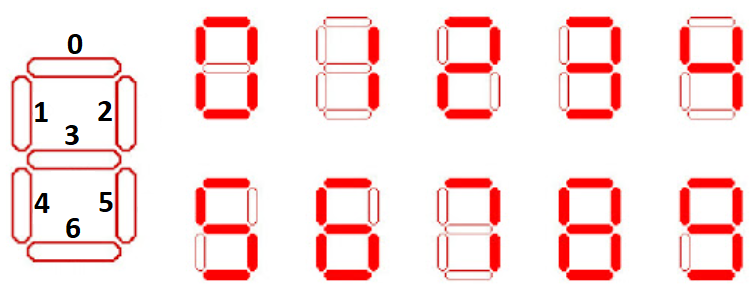

# PJP PEC 2

En esta PEC vamos a practicar la programación con JavaScript por medio de ejercicios concretos que evaluarán una o varias características del lenguaje.

## Competencias

En esta PEC se desarrollan las siguientes competencias del Máster:

* [CB10] Que los estudiantes posean las habilidades de aprendizaje que les permitan continuar estudiando de una manera que tendrá que ser en gran medida autodirigida o autónoma.
* [CG1] Analizar y sintetizar información técnica compleja.
* [CE3] Utilizar de manera adecuada los lenguajes de programación y las mejores herramientas de desarrollo para el análisis, el diseño y la implementación de lugares y aplicaciones web en función de las necesidades del proyecto.
* [CE8] Adaptarse a las tecnologías web y a los futuros entornos actualizando las competencias profesionales.

## Objetivos

Los objetivos concretos de esta PEC son:

* Aprender a utilizar JavaScript y sus características básicas.
* Contribuir a conocer a fondo el lenguaje JavaScript para poder usarlo en el desarrollo de aplicaciones Web.

## Entrega de la PEC

Una vez hayas realizado las actividades prácticas propuestas en este enunciado, **la entrega se realizará de forma doble**:

- Deberás enviar tus cambios al apartado del aula virtual de la UOC.
- Deberás enviar tus cambios al repositorio de GitHub Classroom.

Recuerda que este repositorio lo has clonado del repositorio en GitHub. Cuando trabajes en tu sistema, todos los cambios los harás en tus ficheros locales, los cuales tendrás que añadir y _comitear_ a tu repositorio Git. Estos cambios estarán en tu sistema hasta que hagas _push_ y los envíes al repositorio en GitHub.

Recuerda que debes trabajar en la rama _main_ o _master_ (la que se cree por defecto). Puedes hacer varios envíos.

En el aula virtual encontrarás una _checklist_ que te ayudará a repasar todos los pasos que debes hacer para la entrega de tu PEC.

## Puntuación

El hecho de trabajar con tests para verificar la funcionalidad del código os permitirá tener una idea de vuestra propia nota antes de la entrega. 

La puntuación de los ejercicios prácticos se basa en dos criterios: **Funcionalidad** e **Implementación**. Se espera que los ejercicios funcionen correctamente (pasen los tests) y que la implementación (el código) tenga una calidad adecuada. 

Algunos detalles a tener en cuenta:

- Se penalizará cualquier intento de _hardcodear_ los tests para forzar que pasen. Esta técnica consiste en cambiar la implementación para que devuelva únicamente el valor esperado por el test (cualquier otro test fallaría).
- Los tests automáticos están diseñados para detectar ejercicios erróneos o incompletos para casos concretos. El hecho de que un test pase no garantiza que el ejercicio esté realizado correctamente, es decir, que cubra todos los casos.
- Un ejercicio cuyos tests no pasan se puntuará con un 0 salvo que existan problemas con el test.
- Además de pasar los tests, el profesorado evaluará vuestro código en base a los siguientes criterios:
  - Legibilidad, sencillez y calidad del código.
  - Conocimientos de programación. Por ejemplo, no utilizar las estructuras de control adecuadas, como utilizar un bucle para construir una sentencia condicional o viceversa.

## Requisitos mínimos

- Tener instalado Visual Studio Code (o cualquier otro IDE).
- Conocimientos básicos de Git y GitHub (Actividades 2 y 3 del Reto 1).
- Estudio de la introducción y repaso a JavaScript (Actividad 1 del Reto 2).
- Estudio de la conceptos de JavaScript (Actividad 2 del Reto 2).

## Ejercicios prácticos (10 puntos)

Para realizar los ejercicios prácticos debes dirigirte a la siguiente ruta, dentro del repositorio: `src/pec2/pec2.js`.
En este fichero deberás implementar las funciones que te indicamos en los ejercicios que verás más abajo.

Por otro lado, los tests que te permitirán saber si la solución que propones para los ejercicios es correcta están en el fichero `src/pec2/pec2.spec.js`.
**No debes editar este fichero**.
Ten en cuenta que los tests son condiciones que deben cumplir las funciones que implementarás en los ejercicios, por lo que pueden servirte de ayuda para corregirlos.

### Preparando el entorno

Una vez hecho **clone** del repositorio, debes instalar las dependencias del proyecto.

```
npm install
```

A continuación, para lanzar los tests debes ejecutar el siguiente comando:

```
npm t
```

La instrucción anterior lanzará los tests cada vez que guardes el fichero `src/pec2/pec2.js`, que es precisamente donde implementarás los ejercicios de esta PEC.

Tal y como te indicamos en la PEC 1, la primera vez que ejecutes `npm t` y se lancen los tests, muy posiblemente fallarán todos, ya que no hay ningún ejercicio implementado. Conforme vayas trabajando en los ejercicios y guardes el fichero, puede que algún test lance algún error. Revisa el mensaje de error que se imprime para conocer su formato y entender cómo se notifican los errores.

Si tienes algún problema con los tests, no dudes en preguntar en el foro "Dudas PEC 2 | Dubtes PAC 2" del aula.

### Ejercicio 1 (1.0 punto)

#### Objetivo

Implementar la función que calcule el cambio para una cantidad de Euros dada, utilizando el **menor número de billetes y monedas posibles**. La función debe devolver el resultado en un formato estructurado.

#### Descripción

Desarrolla la función `calculateChange(amount)` que recibe un importe en formato de número decimal y devuelve un objeto que representa el cambio con el menor número posible de billetes y monedas. La función debe contemplar los siguientes billetes y monedas:

- Billetes: 500€, 200€, 100€, 50€
- Monedas: 20€, 10€, 5€, 2€, 1€, 0.50€, 0.20€, 0.10€, 0.05€, 0.02€, 0.01€

#### Requisitos

1. **Control de Errores**: La función debe lanzar un error con el mensaje `Amount must be a non-negative number` si el importe es un número negativo.
2. **Formato del Resultado**: El resultado debe ser un objeto donde las **keys** son los valores de los billetes y monedas y sus **values** son las cantidades necesarias de cada billete o moneda.

#### Ejemplo

```js
calculateChange(18.47);
// Output: {'10': 1, '5': 1, '2': 1, '1': 1, '0.2': 2, '0.05': 1, '0.02': 1 }
```

### Ejercicio 2 (1.5 puntos)

#### Objetivo

Implementar una clase que simule la representación de un dígito en un reloj digital utilizando un display de 7 segmentos. La representación del dígito debe dibujarse en una matriz de 3 columnas por 5 filas, utilizando caracteres específicos para simular los segmentos encendidos.

#### Descripción

Un reloj digital utiliza un display de 7 segmentos para mostrar cada uno de sus dígitos. Cada dígito (del 0 al 9) se compone de 7 segmentos que pueden estar encendidos o apagados. Estos segmentos están dispuestos en la siguiente configuración:



Cada dígito puede representarse activando ciertos segmentos. Por ejemplo:
- El número `8` tiene todos los segmentos encendidos.
- El número `1` solo tiene los segmentos 2 y 5 encendidos.

#### Instrucciones

Crea una clase `DisplayDigit`, que contenga:

- Un constructor que inicialice una estructura de dígitos codificados utilizando un array bidimensional de números (con valores 0 y 1) que representen los segmentos apagados o encendidos. Cada número (0-9) debe tener una configuración específica de dicha estructura de datos que active o desactive los 7 segmentos.
- Un método `displayDigit(digit)` que acepte un único parámetro `digit` (un número entero entre 0 y 9) y devuelva un array de 5 cadenas de texto, donde cada cadena representa una fila de la matriz 3x5 correspondiente al dígito mostrado en un reloj digital.
  - Si el valor de `digit` no es un número válido entre 0 y 9, el método `displayDigit(digit)` debe lanzar un error con el siguiente mensaje: `The digit must be a number between 0 and 9`.
  - **Visualización de los segmentos**: En un entorno gráfico, en donde cada uno de los 7 segmentos pueden representarse como líneas horizontales o verticales, sería sencillo representar visualmente el display; bastaría con mostrar o no cada segmento en función del valor de su bit asociado. En nuestro caso, también nos basaremos en la estructura de dígitos codificados, pero tendremos que implementar la visualización de forma manual, de manera que cada segmento podrá estar representado por más de un caracter.

#### Configuración de los segmentos

Debes crear una estructura que simule los segmentos encendidos o apagados utilizando cadenas de caracteres para representar estos segmentos.

Utiliza el carácter "█" (bloque lleno) para construir la representación de un segmento encendido, y el caracter " " (espacio) para hacer lo propio con un segmento apagado.

Por ejemplo, los segmentos horizontales (0, 3 y 6) deben estar compuestos de tres "█" o " " consecutivos, en función de si están encendidos o apagados, respectivamente.

#### Ejemplos

Llamando a la función con el número 8, la salida debería ser una matriz con el siguiente contenido:

```js
[
  "███",  // Segmento superior encendido
  "█ █",  // Segmentos izquierdo y derecho (arriba) encendidos
  "███",  // Segmento medio encendido
  "█ █",  // Segmentos izquierdo y derecho (abajo) encendidos
  "███"   // Segmento inferior encendido
]
```

Para el número 1, la salida sería:

```js
[
  "  █",  // Segmento superior apagado
  "  █",  // Solo el segmento derecho (arriba) encendido
  "  █",  // Segmento medio apagado
  "  █",  // Solo el segmento derecho (abajo) encendido
  "  █"   // Segmento inferior apagado
]
```

>**Nota**: Fíjate en que hay segmentos que comparten algun caracter (se cruzan). Por ejemplo, en el caso del número 1, los segmentos 0 y 2 comparten el caracter superior derecho. Deberás gestionar estos cruces cuando configures la visualización de los segmentos.

### Ejercicio 3 (2.0 puntos)

#### Objetivo

Implementar una clase que simule un reloj digital utilizando un display de 7 segmentos para representar la hora actual (en formato de 24 horas), minutos y segundos.

#### Descripción

Un reloj digital típico usa displays de 7 segmentos para representar sus números. En este ejercicio, debes crear una clase que reciba la fecha y hora actual, y la muestre en un formato visual similar al de un reloj digital de siete segmentos:


#### Instrucciones

- Implementar una clase `DigitalClock`, que contenga:
  - Un constructor que reciba un parámetro que será un objeto `Date`. Si el parámetro no es una instancia de `Date`, debe lanzar un error con el siguiente mensaje: `The parameter must be a Date object`.
    - Debe obtener las horas (0-23), minutos (0-59), y segundos (0-59) a partir del parámetro de fecha recibido. 
    - Las propiedades de la clase que almacenarán estos valores se llamarán: `hours`, `minutes` y `seconds`.
- Método `displayTime()`:
  - Este método debe formatear la hora pasada por parámetro en el constructor, en formato HH:MM:SS, utilizando un display de 7 segmentos para cada dígito.
  - Debe devolver un array de 5 cadenas de texto, representando la hora.
  - Deben simbolizarse los dos puntos `:` entre las horas, minutos y segundos. Para ello utilizaremos el caracter de bloque lleno "█".

**Nota**: Puedes utilizar métodos complementarios, si lo necesitas. Por ejemplo: Te podría ser muy útil un método `formatNumber(number)`, para añadir un 0 a la izquierda de un dígito.

#### Ejemplo

```js
[
  '███   █     ███ ███     █ █ ███',
  '█ █   █  █    █   █  █  █ █ █  ',
  '█ █   █     ███ ███     ███ ███',
  '█ █   █  █  █     █  █    █   █',
  '███   █     ███ ███       █ ███'
]
```

### Ejercicio 4 (2.0 puntos)

#### Objetivo

Implementar una estructura de clases y subclases que modelen diferentes tipos de construcciones: Edificios, Puentes y Carreteras. Deberás crear una clase base `Construction` y luego extender otras clases más específicas: `Building`, `Bridge` y `Road`. Cada clase tendrá sus propias propiedades y métodos que representan características y comportamientos de cada tipo de construcción.

#### Instrucciones

- Implementa una clase `Construction`, que cumpla con las siguientes características:
  - Debe incoporar las siguientes **propiedades**:
    - `name`: Nombre de la construcción.
    - `location`: Ubicación de la construcción.
  - Debes implementar los siguientes **métodos**:
    - Getters y Setters para todas las propiedades. Deben ser métodos básicos, sin ninguna verificación.
    - `getDescription`: Debe devolver un string con el siguiente formato: "[name] located in [location]".
    - `getTotalInstances`: Método *estático* que devuelva el número total de instancias creadas de la clase `Construction` y sus subclases. Para ello, puedes utilizar una propiedad estática `instanceCount` que se incremente en el constructor cada vez que se cree una nueva instancia de la clase o sus subclases.

      >**Pista**: Obtén Información sobre métodos y propiedades estáticas [aquí](https://developer.mozilla.org/en-US/docs/Web/JavaScript/Reference/Classes/static).

- Implementa una clase `Building`, que cumpla con las siguientes características:
  - Debe extender de la clase `Construction`.
  - Debe incorporar las siguientes **propiedades**:
    - `floors`: Número de pisos del edificio
    - `material`: Material de construcción del edificio
  - Debes implementar los siguientes **métodos**:
    - Implementa los getters básicos para las nuevas propiedades.
    - Implementa un setter para la propiedad `floors` que permita asignar el número de pisos, con los siguientes condicionantes:
      - Solo se aceptarán valores numéricos entre 1 y 50.
      - Si el número de pisos es menor que 1 o mayor que 50, se deverá lanzar un error con el siguiente texto: `The number of floors must be between 1 and 50`.
    - Implementa un setter para la propiedad `material` que permita asignar el material, con los siguientes condicionantes:
      - El material debe transformarse a mayúsculas automáticamente.
      - Si el material (ya en mayúsculas) no es `WOOD`, `STONE` o `GLASS`, debes lanzas un error utilizando con el texto: `Material must be one of the following: WOOD, STONE, GLASS`.
    - `getDescription`: Que devuelva un string con el siguiente formato: "[name] located in [location] with [floors] floors built with [material]".

- Implementa una clase `Bridge`, que cumpla con las siguientes características:
  - Debe extender de la clase `Construction`.
  - Debe incorporar las siguientes **propiedades**:
    - `length`: Longitud del puente, en metros.
    - `maxLoad`: Capacidad máxima de carga, en toneladas.
  - Debes implementar los siguientes **métodos**:
    - Getters y Setters para las nuevas propiedades. Deben ser métodos básicos, sin ninguna verificación.
    - `getDescription`: Que devuelva un string con el siguiente formato: "[name] located in [location] spanning [length] meters, max load [maxLoad] tons".

- Implementa una clase `Road`, que cumpla con las siguientes características:
  - Debe extender de la clase `Construction`.
  - Debe incorporar las siguientes **propiedades**:
    - `lanes`: Número de carriles.
    - `surfaceMaterial` Material de la superficie de la carretera.
  - Debes implementar los siguientes **métodos**:
    - Implementa un getter para la propiedad `lanes` que devuelva el número de carriles.
    - Implementa un setter para la propiedad `lanes` que permita asignar el número de carriles, con los siguientes condicionantes:
      - Si el valor de `lanes` no es un número positivo mayor que 0, lanza un error con el texto: `Lanes must be a positive number greater than 0`.
      - Si el valor de `lanes` es mayor que 5, el setter debe ajustar automáticamente el valor a 5.
    - Implementa un getter para la propiedad `surfaceMaterial` que devuelva el material de la superficie.
    - Implementa un setter para la propiedad `surfaceMaterial` que permita asignar el material de la superficie.
    - `getDescription`: Que devuelva un string con el siguiente formato: "[name] located in [location] with [lanes] lanes, surfaced with [surfaceMaterial]".

### Ejercicio 5 (2.5 puntos)

#### Objetivo

Implementar una estructura de clases que amplíe la estructura del ejercicio anterior, introduciendo nuevos tipos de puentes: `SuspensionBridge` y `ArchBridge` y de carreteras:  `Highway` y `Street`. Cada clase tendrá sus propias propiedades y métodos que representen características específicas de cada tipo de construcción.

#### Instrucciones

- Implementa una clase `SuspensionBridge`, que cumpla con las siguientes características:
  - Debe extender de la clase `Bridge`.
  - Debe incorporar la **propiedad**:
    - `cableType`: Tipo de cable utilizado en el puente colgante.
  - Debes implementar los siguientes **métodos**:
    - Getters y Setters para la propiedad `cableType`. El setter debe permitir asignar cualquier valor como tipo de cable.
    - `getDescription`: que devuelva un string con el siguiente formato: "Suspension Bridge: [name] located in [location] spanning [length] meters, max load [maxLoad] tons, using [cableType] cables".

- Implementa una clase `ArchBridge`, que cumpla con las siguientes características:
  - Debe extender de la clase `Bridge`.
  - Debe incorporar la **propiedad**:
    - `archMaterial`: Material con el que están hechos los arcos del puente.
  - Debes implementar los siguientes **métodos**:
    - Getters y Setters para la propiedad `archMaterial`. El setter debe permitir asignar cualquier valor como material del arco.
    - `getDescription`: Que debe devolver un string con el siguiente formato: "Arch Bridge: [name] located in [location] spanning [length] meters, max load [maxLoad] tons, with arches made of [archMaterial]".

- Implementa una clase `Highway`, que cumpla con las siguientes características:
  - Debe extender de la clase `Road`.
  - Debe incorporar las siguientes **propiedades**:
    - `tollRoad`: Valor booleano que indica si la autopista tiene peaje.
    - `suspensionBridges`: Un array que contiene instancias de `SuspensionBridge`.
    - `archBridges`: Un array que contiene instancias de `ArchBridge`.
  - Debes implementar los siguientes **métodos**:
    - Getters y Setters para la propiedad `tollRoad`. El setter debe aceptar solo valores booleanos; si el valor de `tollRoad` no es un valor booleano, debes lanzas un error con el texto: `tollRoad must be a boolean value`.
    - `addSuspensionBridge` y `addArchBridge`: Para añadir puentes del tipo correspondiente a sus arrays. Si se intenta añadir una instancia que no sea del tipo adecuado, se debe lanzar un error con el mensaje: `Only SuspensionBridge instances can be added` o `Only ArchBridge instances can be added`, según corresponda.
    - `removeSuspensionBridge` y `removeArchBridge`: Para eliminar puentes del array correspondiente.
    - `getTotalBridges`: Que debe devolver el número total de puentes (tanto colgantes como de arco).
    - `getDescription`: Debe devolver un string que incluya información sobre los puentes y si la autopista tiene peaje, con el siguiente formato: "Highway: [name] located in [location] with [lanes] lanes, surfaced with [surfaceMaterial], [tollRoad ? 'toll road' : 'no toll'], with [totalBridges] bridges: [suspensionBridges descriptions] [archBridges descriptions]". Si no tiene puentes, debe devolver "no bridges". Ejemplos:
      - **Sin puentes**: "Highway: Main Highway located in City A with 4 lanes, surfaced with Asphalt, toll road, no bridges".
      - **Con puentes**: "Highway: Main Highway located in City A with 4 lanes, surfaced with Asphalt, toll road, with 2 bridges: suspension bridges: Suspension Bridge: Golden Gate located in City A spanning 2000 meters, max load 1000 tons, using steel cables; Suspension Bridge: Brooklyn Bridge located in City B spanning 1800 meters, max load 900 tons, using steel cables".

- Implementa una clase `Street`, que cumpla con las siguientes características:
  - Debe extender de la clase `Road`.
  - Debe incorporar la **propiedad**:
    - `hasSidewalks`: Valor booleando que indica si la calle tiene aceras.
  - Debes implementar los siguientes **métodos**:
    - Getter para la propiedad `hasSidewalks`: Debe devolver un string con el valor "Yes" o "No".
    - Setter para la propiedad `hasSidewalks`: Debe aceptar solo valores booleanos y lanzar un error con el texto "hasSidewalks must be a boolean value", si el parámetro de entrada no es de tipo booleano.
    - `getDescription`: Debe devolver un string en el siguiente formato: "Street: [name] located in [location] with [lanes] lanes, surfaced with [surfaceMaterial] [hasSidewalks ? 'with sidewalks' : 'without sidewalks']". Ejemplos:
      - **Sin aceras**: "Street: Street A located in City A with 2 lanes, surfaced with asphalt without sidewalks".
      - **Con aceras**: "Street: Street A located in City A with 2 lanes, surfaced with asphalt with sidewalks".

### Ejercicio 6 (1.0 punto)

Este ejercicio está pensado para entender que hay otra forma de crear objetos. Esta forma se considera *legacy* pero es una técnica que se sigue utilizando y es importante entender que las clases son *syntax sugar* de dicha técnica. Además, este ejercicio te servirá para practicar y entender los *prototipos* y el uso de *this* en JavaScript.

#### Objetivo

El objetivo de este ejercicio es implementar una función constructora llamada `ConstructionFunction` que permita modelar una construcción con propiedades como el nombre y la ubicación. Esta función debe proporcionar métodos para obtener y modificar dichas propiedades, además de un método para obtener una descripción completa de la construcción.

#### Requisitos

La función constructora ha de cumplir con los siguientes requisitos:

- Debe recibir dos parámetros: `name` (nombre de la construcción) y `location` (ubicación de la construcción).
  - Estos valores deben almacenarse en propiedades privadas _name y _location.  
- Debe implementar los siguientes métodos dentro de la función constructora:
  - `getName()`: Devuelve el nombre de la construcción.
  - `setName(newName)`: Permite modificar el nombre de la construcción.
  - `getDescription()`: Devuelve un string que describa la construcción, con el siguiente formato: "[nombre] located in [ubicación]".
- Adicionalmente, se deben implementar en el *prototipo* de `ConstructionFunction` los siguientes métodos:
  - `getLocation()`: Devuelve la ubicación de la construcción.
  - `setLocation(newLocation)`: Permite modificar la ubicación de la construcción.
